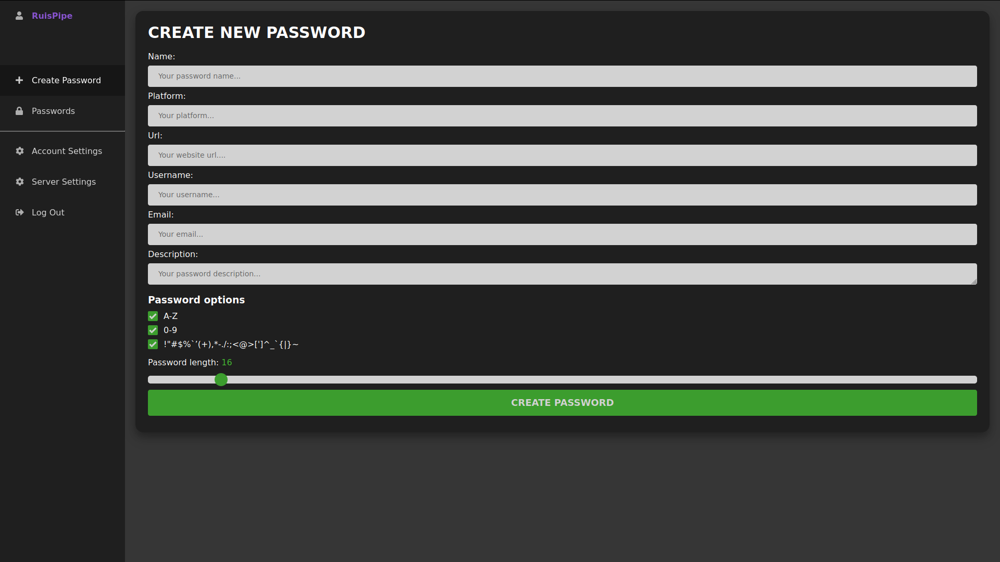
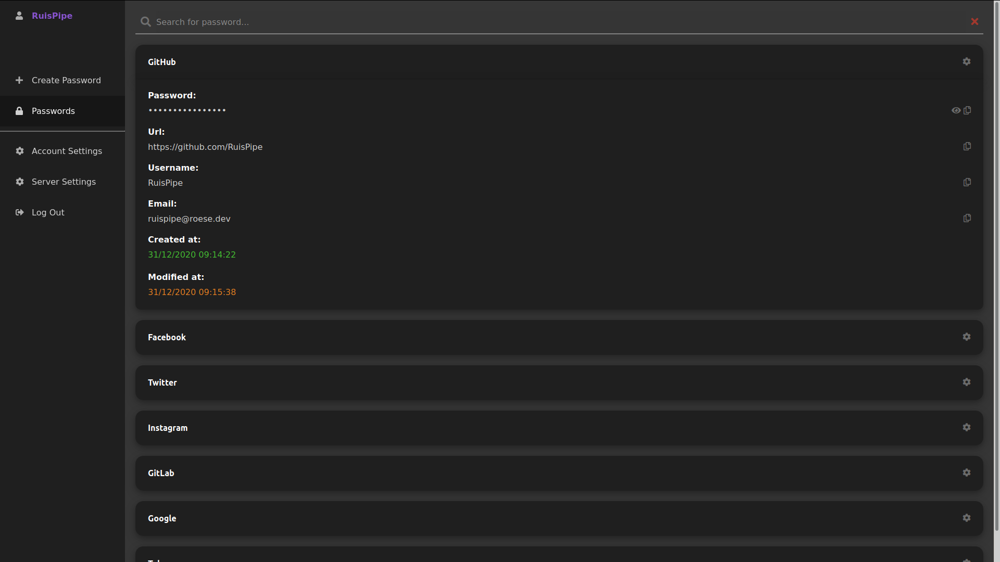
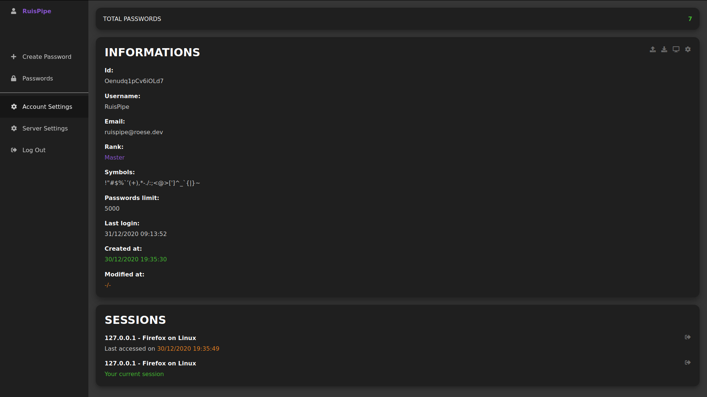
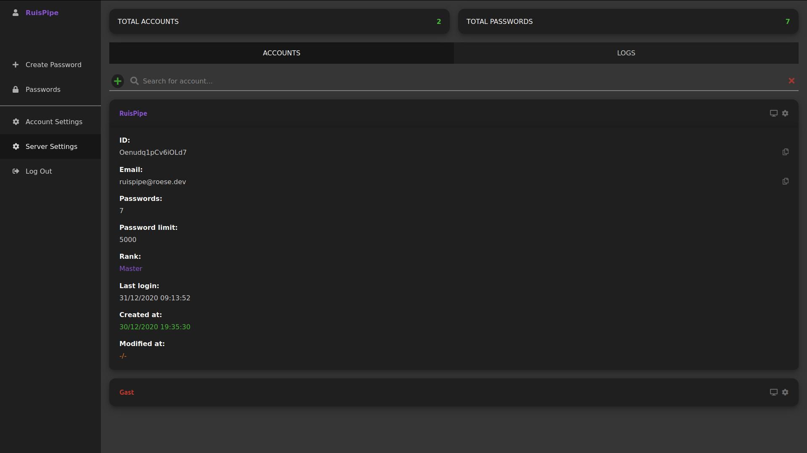
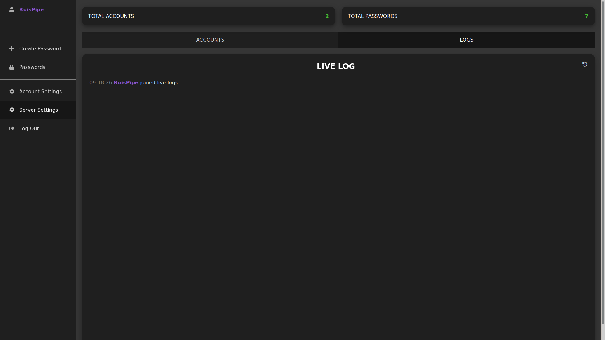

# PasswordManager

## Self-hosted encrypted password manager

Host your own password manager and share a server with friends or family.

## Featues

- Strong encryption using AES-256
- Bcrypt hashed storage of login password
- Log-System
- Email-System
- Integrated database [(lowDb)](https://github.com/typicode/lowdb)
- Multi account system
- Import passwords (encrypted and decrypted)
- Export passwords (encrypted and decrypted)

## Requirements:

- Node.Js (tested on v. 14.8.0)
- SSL certificate for HTTPS encryption

## Installation:

1. Download latest release
2. Extract to folder
3. Navigate to folder containing the files in terminal
4. Run `npm install`
5. Add your private key `/src/sslcert/localhost.key` and certificate `/src/sslcert/localhost.crt`
6. Run `node app`
7. Follow the steps to create an account

If you get the error 
`(node:42501) [DEP0066] DeprecationWarning: OutgoingMessage.prototype._headers is deprecated
(Use 'node --trace-deprecation ...' to show where the warning was created)`  
then go to `node_modules/spdy/lib/spdy/response.js` and change line 18 to `if (this.getHeaders()) {`

## Screenshots

## FAQ

How can I install Node.Js?
- Download it [here](https://nodejs.org/en/download/)

Is it necessary to add an email account to use the password manager?
- No. If you add an email account, you will receive an email if you have logged into your account, if changes have been made to the account or an encrypted export of the passwords if the account has been deleted

How can I generate a certificate?
- You can generate a certificate with [OpenSSL](https://www.openssl.org/) or with [Let's Encrypt](https://letsencrypt.org/)

## LICENSE

MIT - [RuisPipe](https://github.com/ruispipe)